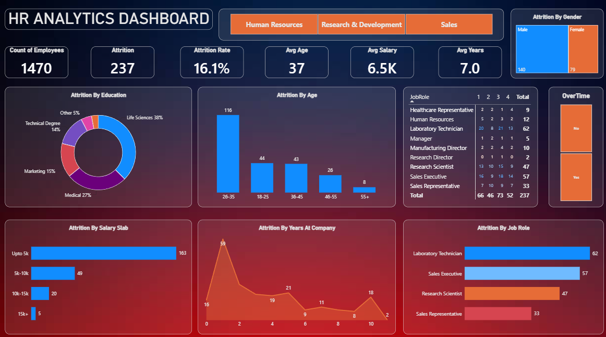

# HR Analytics Power BI Dashboard

An interactive **HR Analytics Dashboard** created using Microsoft Power BI to explore employee attrition and understand different workforce-related patterns.

This project was created as a learning project to practice data visualization, dashboard design, and basic analysis using Power BI.

---

## Dashboard Preview

---

## Project Overview

The **HR Analytics Dashboard** provides a visual overview of employee data and focuses mainly on employee attrition.

The dashboard helps explore how attrition varies across different factors such as:

- Education
- Age
- Salary
- Years at the company
- Job role
- Gender
- Overtime

It also provides an overall view of the number of employees, attrition count, and attrition rate.

---

## Key Metrics

The dashboard currently displays the following key metrics:

| Metric | Value |
|--------|-------|
| Total Employees | 1,470 |
| Attrition | 237 |
| Attrition Rate | 16.1% |
| Average Age | 37 |
| Average Salary | 6.5K |
| Average Years at Company | 7.0 |

---

## Dashboard Sections

### 1. Employee Overview

The top section provides a quick summary of the workforce through:

- Total number of employees
- Attrition count
- Attrition rate
- Average employee age
- Average salary
- Average years at the company

### 2. Attrition by Education

A donut chart showing the distribution of employee attrition across different educational backgrounds, including:

- Life Sciences
- Medical
- Marketing
- Technical Degree
- Other

### 3. Attrition by Age

A bar chart showing attrition across different age groups:

- 18–25
- 26–35
- 36–45
- 46–55
- 55+

### 4. Attrition by Salary Slab

This section analyzes attrition across different salary ranges:

- Up to 5K
- 5K–10K
- 10K–15K
- 15K+

### 5. Attrition by Years at Company

A visual showing how employee attrition varies based on the number of years employees have spent at the company.

### 6. Attrition by Job Role

A comparison of attrition across different job roles, including:

- Laboratory Technician
- Sales Executive
- Research Scientist
- Sales Representative
- And other roles

### 7. Gender and Overtime

The dashboard also includes breakdowns of attrition based on:

- Gender
- Overtime status

---

## Tools Used

- **Microsoft Power BI**
- **Power Query** – Data preparation and transformation
- **DAX** – Creating calculations and measures
- **Data Visualization** – Charts, cards, and dashboard design

---

## What I Practiced

Through this project, I practiced:

- Importing and working with data in Power BI
- Basic data cleaning and transformation
- Creating calculated measures using DAX
- Building interactive visualizations
- Using different chart types effectively
- Creating KPI cards
- Analyzing employee attrition
- Designing a simple and structured dashboard
- Presenting data in an easy-to-understand format

---

## Key Learnings

This project helped me understand how Power BI can be used to convert raw employee data into a visual dashboard and make it easier to identify patterns in attrition and workforce data.

Some of the areas explored include the relationship between attrition and:

- Age
- Salary
- Education
- Job role
- Overtime
- Years at the company
- Gender
  
